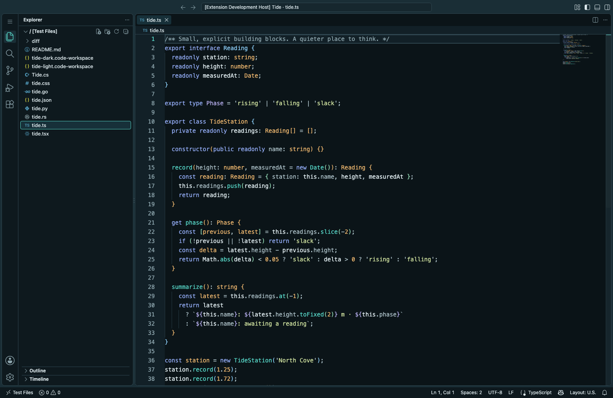
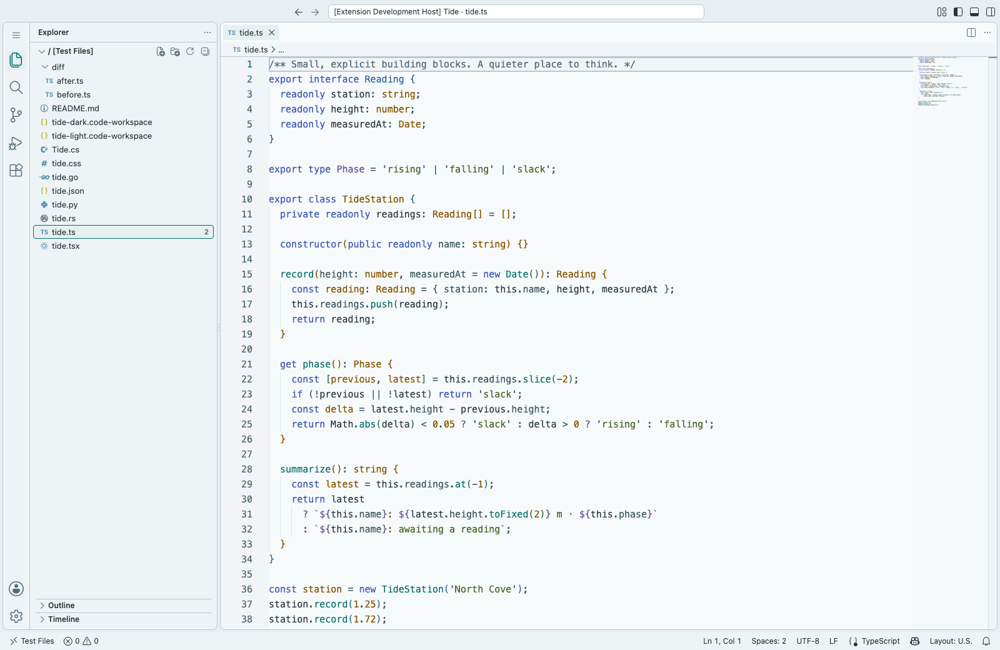
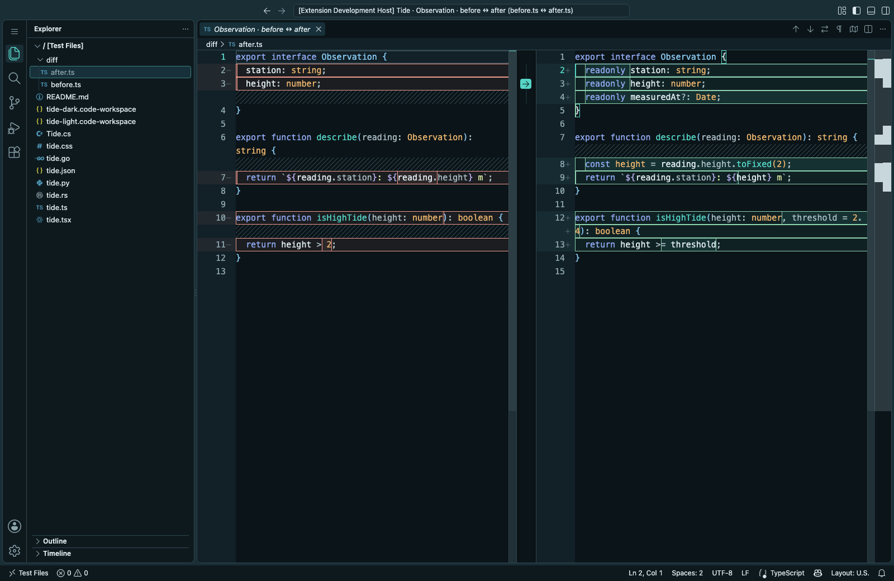
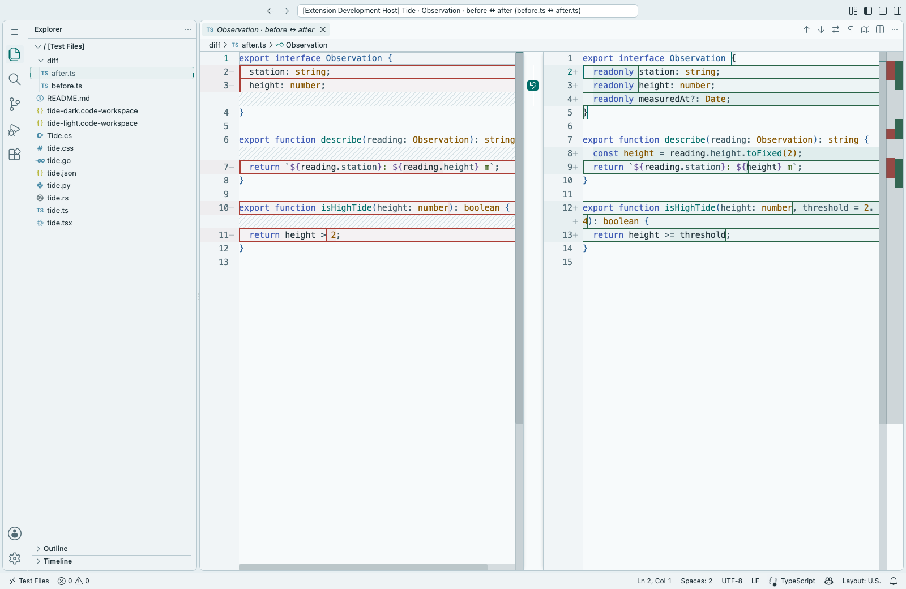

<div align="center">


# Tide

**A quieter place to think.**

Sea-glass teal. Warm amber. Quiet blue-slate.
Two carefully paired themes for Visual Studio Code.

[Design](#design) · [Install](#install) · [Accessibility](#accessibility) · [Develop](#develop)



_Tide Dark — deep blue-black surfaces, soft ice text, and selective color._



_Tide Light — cool off-white, deep colored inks, and the same visual hierarchy._

</div>

## Design

Tide keeps the interface in the background. Teal identifies actions and calls;
amber gives types and constants a recognizable shape. Periwinkle keywords and
sage strings add separation without turning every token into an accent.

- **Neutral chrome:** menus, tabs, sidebars, and status text stay quiet.
- **Non-italic typography:** including comments and semantic tokens. Markdown
  headings retain bold; links retain underlines.
- **Purposeful states:** clear focus outlines, restrained selections, and
  understated diff fills with distinct gutters and borders.
- **Modern coverage:** workbench, terminal, diagnostics, notebooks, testing,
  debugging, inline edits, chat, agent sessions, and modern tabs/activity bars.
- **Native and lightweight:** two declarative themes; no runtime dependencies,
  activation code, telemetry, or settings changes.

| Role             | Dark      | Light     |
| ---------------- | --------- | --------- |
| Canvas           | `#0B1418` | `#F7FAFB` |
| Foreground       | `#DCE8EC` | `#23343B` |
| Teal / functions | `#56D4C5` | `#006D68` |
| Amber / types    | `#EBB56E` | `#875600` |
| Keywords         | `#91AAF2` | `#405BB5` |
| Strings          | `#C7D99A` | `#496A2A` |
| Comments         | `#8DA5AD` | `#526B75` |

### Built for review

Diffs use restrained teal/coral fills, clear word outlines, and readable gutter
numbers. Normal-size code keeps its 4.5:1 contrast floor across the modeled
diff backgrounds.

| Tide Dark                                                 | Tide Light                                                  |
| --------------------------------------------------------- | ----------------------------------------------------------- |
|  |  |

## Install

Build an installable extension from this repository:

```sh
npm ci
npm run package
code --install-extension dist/tide-theme-0.1.0.vsix
```

Alternatively, use **Extensions → … → Install from VSIX** and select that file.
Then open **Preferences: Color Theme** (`⌘K ⌘T` on macOS, `Ctrl+K Ctrl+T`
on Windows/Linux) and choose **Tide Dark** or **Tide Light**.

Requires **VS Code 1.137.0 or newer**, or a compatible editor.

## Accessibility

The automated contract measures **normal-size text at 4.5:1** and **essential
non-text indicators at 3:1**, with alpha-composited backgrounds. Code on diff
highlights has the same text threshold as code on the main editor surface.

Every configured workbench color is accounted for in the audit or has an
explicit exclusion. Validation rejects unsupported color names, missing pairs,
unclassified additions, semantic italics, and dark/light coverage drift.

These checks establish the modeled contrast contract, not universal WCAG
conformance for every extension, overlay combination, terminal application, or
user customization. See [the accessibility contract](docs/ACCESSIBILITY.md)
for coverage, exceptions, and how to reproduce the results.

## Develop

Use **Node.js 24.11+ (24.x)**. The Node version, dependencies, VS Code release, and test
grammars are pinned for reproducible development.

```sh
npm ci
npm run build          # generate both themes from shared roles
npm run check          # drift, registry, contrast, grammar, and regression tests
npm run preview        # real VS Code in a browser at http://localhost:4173
```

For desktop preview, open this repository in VS Code and press `F5` using
**Preview Tide Dark** or **Preview Tide Light**. See [CONTRIBUTING.md](CONTRIBUTING.md)
for the source layout and visual-review workflow.

### Screenshots and runtime checks

```sh
npx playwright install chromium
npm run capture
```

This opens the **pinned VS Code 1.137.0 build**, verifies the active workbench
palette and nine rendered semantic roles, and captures dark/light source,
inline/side-by-side diffs, diagnostics, and TextMate-only views. Primary
screenshots are written to `assets/`; additional captures and reports go to
`dist/`. Browser/font rendering can differ across operating systems.

### Quality reports

`npm run check` writes machine-readable contrast and grammar reports under
`dist/`. CI builds the VSIX and retains reports; the visual job separately checks
real-editor loading and captures screenshots.

## License

[MIT](LICENSE)
